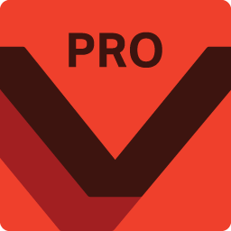

# Hi, I'm Kaweees 👋

#### Also known as "Kiwis"

## Curious, Creative, and Clever 💻

 

## What I'm Doing

- 💾 I’m currently a high school student and a frontend developer at [NovaCrypt](https://novacrypt.org/)
- 🌱 I’m currently learning [Bootstrap 5](https://getbootstrap.com/)
- 📫 How to reach me: For questions or other things contact me through [Discord (Kaweees#1134)](https://discord.com/users/489505423968436224)
- 💬 Ask me about React, Arduino and Python
- ✉️ miguelvillafloran@gmail.com
- 🎨 Portfolio: https://miguelvf.com/
- 💼 LinkedIn: https://www.linkedin.com/in/miguel-vf/
- ⚡ Fun Fact: I play Brawl Stars, here is my id if interested: **PV9CC8CJU**

## Connect with me

  
  
  
  

## Languages and Tools

  
  
  
  
  
  
  
  
  
  
  
  
  
  
  
  
  
  
  
  
    
  
  
  
  
  
  
  
  
  

## Github Stats

> Stats taken from [github-readme-stats](https://github.com/anuraghazra/github-readme-stats)

<!--
Useful Resources:
  - Flag List: https://emojipedia.org/flags/

**Kaweees/Kaweees** is a ✨ _special_ ✨ repository because its `README.md` (this file) appears on your GitHub profile.
