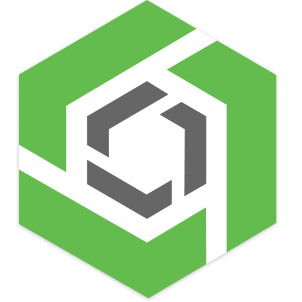

# Hi, I'm Kaweees 

#### Also known as "Kiwis"🥝

## Curious, Creative, and Clever 💻

  
  

## 💻 My Tech Stack

### 🛠️ Languages

  
  
  
  
  
  
  
  
  
  
  

### 🛠️ Tools & Technologies

  
  
  
  
  
  
  
  
  
  
  
  
  
  
  
  
  
  
  

## 📬 Connect with Me
- ✉️ Email: miguelvillafloran@gmail.com
- 🎨 Portfolio: TBD
- 💼 LinkedIn: https://www.linkedin.com/in/miguel-vf/
- 🚀 I'm always open to collaborate on cool and interesting projects 

<!--
Useful Resources:
  - Flag List: https://emojipedia.org/flags/

**Kaweees/Kaweees** is a ✨ _special_ ✨ repository because its `README.md` (this file) appears on your GitHub profile. -->
